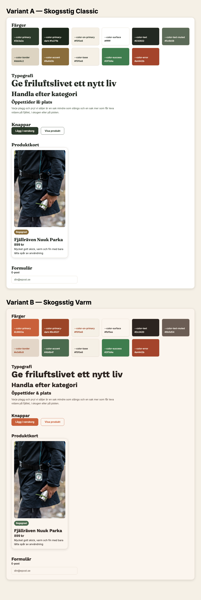

# Style tile — visual reference

A full-page screenshot of `design-system/style-tile/index.html`, captured
2026-08-25, showing both design variants stacked for side-by-side comparison
before any WordPress or React templates are built.



## What this shows

- **Variant A — Skogsstig Classic** (top): forest green (`#2b3a2a`) primary on
  a warm birch/cream base, serif display headings (Fraunces), calm editorial
  magazine feel.
- **Variant B — Skogsstig Varm** (bottom): same layout and component DNA,
  swapped to a warm terracotta/rust accent (`#c9603a`), humanist sans-serif
  headings (Work Sans). A distinct sibling of Classic, not an unrelated
  design.

Both variants share one HTML/CSS structure (`design-system/style-tile/
index.html` + `shared.css`) — only the token values in `classic.css`/
`varm.css` differ. See `docs/design/tokens.md` for the exact color/type/
spacing values, and `design-system/tokens/*.json` for the machine-readable
source that Phase 2 (`theme.json`) and Phase 4 (Tailwind config) will read
from directly.

## Regenerating this screenshot

If the style tile changes, regenerate the screenshot rather than editing it
by hand:

```bash
# from the repo root
python3 -m http.server 8123 &
npx --yes playwright install chromium   # first time only
node -e "
const { chromium } = require('playwright');
(async () => {
  const browser = await chromium.launch();
  const page = await browser.newPage({ viewport: { width: 1280, height: 1000 } });
  await page.goto('http://localhost:8123/design-system/style-tile/index.html', { waitUntil: 'networkidle' });
  await page.screenshot({ path: 'docs/design/style-tile-preview.png', fullPage: true });
  await browser.close();
})();
"
```
